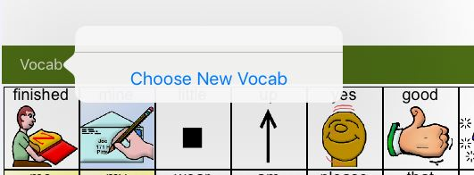
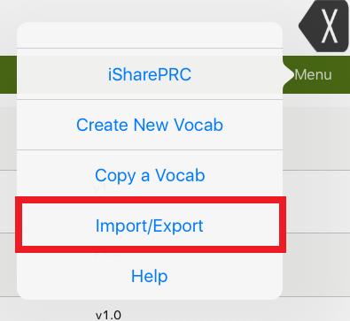
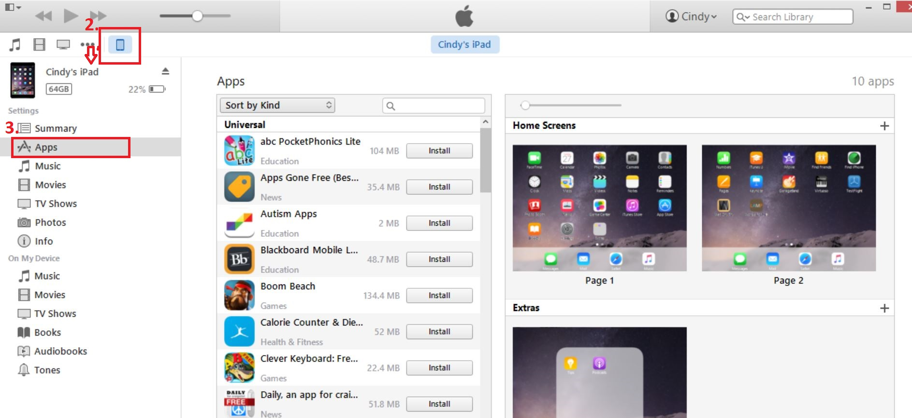
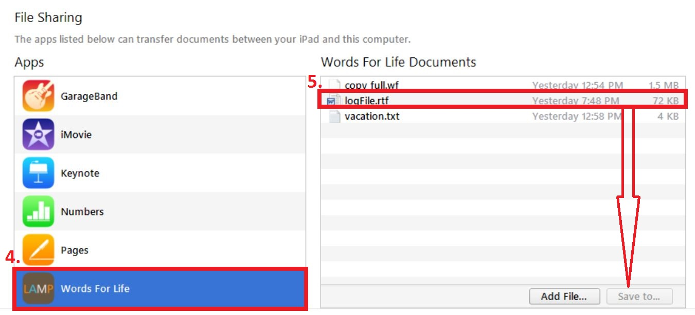

## Proloquo2Go
#### Preparing a Backup:
1. Tap the Options icon in the bottom toolbar.
2. Go to Backup > Export Backup.
3. Find the file you want to export in the list. You may need to scroll down. When you find the file, tap Export on the right side of its row.
4. In the menu that pops up, select Export to iTunes.
5. Wait until you see a “Successfully Exported to iTunes” message, then tap OK.

#### Saving a Backup:
1. Connect your iPad to your computer using the iPad’s charging cable.
2. Click the iPad’s icon in the upper left corner of the iTunes window.

3. In the window that opens on the right, click on the Apps menu at the top.
4. Scroll down to the section called File Sharing and in the Apps column, select the Proloquo2Go app.
5. You will see a list of files. Backup files end in the extension .p2gbk. Select the file you want to save, then click Save to…
6. You can rename the file, but make sure to keep the .p2gbk extension. Choose where you want to save the file, then click Save.

## LAMP Words for Life
#### Preparing a Backup:
1. Select the Vocab button.
2. Touch Choose New Vocab.

3. Touch the Menu button and select Import/Export to iTunes.

4. Choose Export a Vocab and from the menu that pops up, select the vocabulary you want to save.
5. Give the file a name then hit the blue Save button.

#### Saving a Backup:
1. Connect your iPad to your computer using the iPad’s charging cable.
2. Click the iPad icon in the upper left corner of the iTunes window.

3. In the window that opens on the right, click on the Apps menu at the top.
4. Scroll down to the section called File Sharing and in the Apps column, select the Word For Life app.
5. From the column under App Documents, choose the vocabulary file you want to save.
6. Choose the Save to button at the bottom right and a browse to the folder where you want to save the file.

7. Select the OK button and the file will be saved.

## Snap + Core First
#### Preparing a Backup:
1. In the Editor, select the User editing panel tab.
2. Select the current User to access the management options.
3. Select the save icon for the user you want to save as a backup.
4. Rename your backup if you like, then select Backup.

#### Saving a Backup:
1. Connect your iPad to your computer using the iPad’s charging cable.
2. Click the iPad’s icon in the upper left corner of the iTunes window.
3. In the window that opens on the right, click on the Apps menu at the top.
4. Scroll down to the section called File Sharing and in the Apps column, select the Snap + Core First app.
5. Select UserBackups in the Documents browser.
6. Select Save To, then browse to where you want to save your backup files.