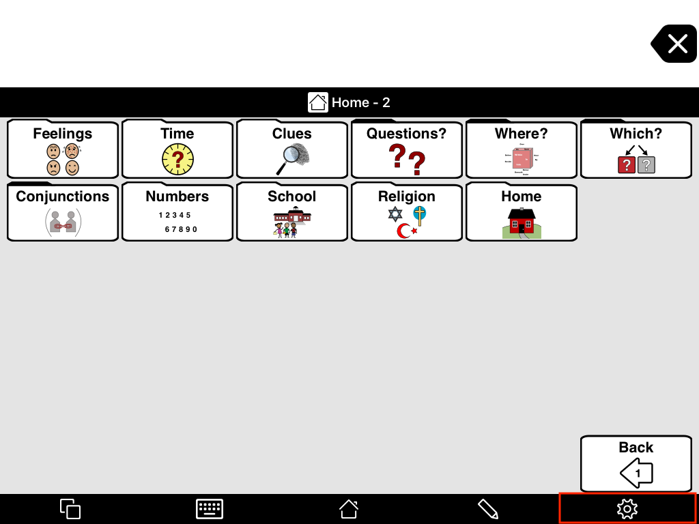
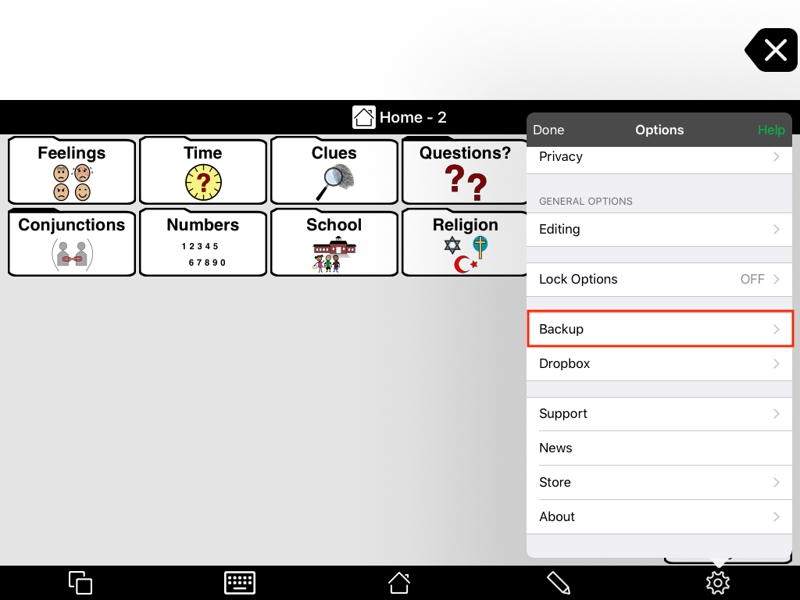
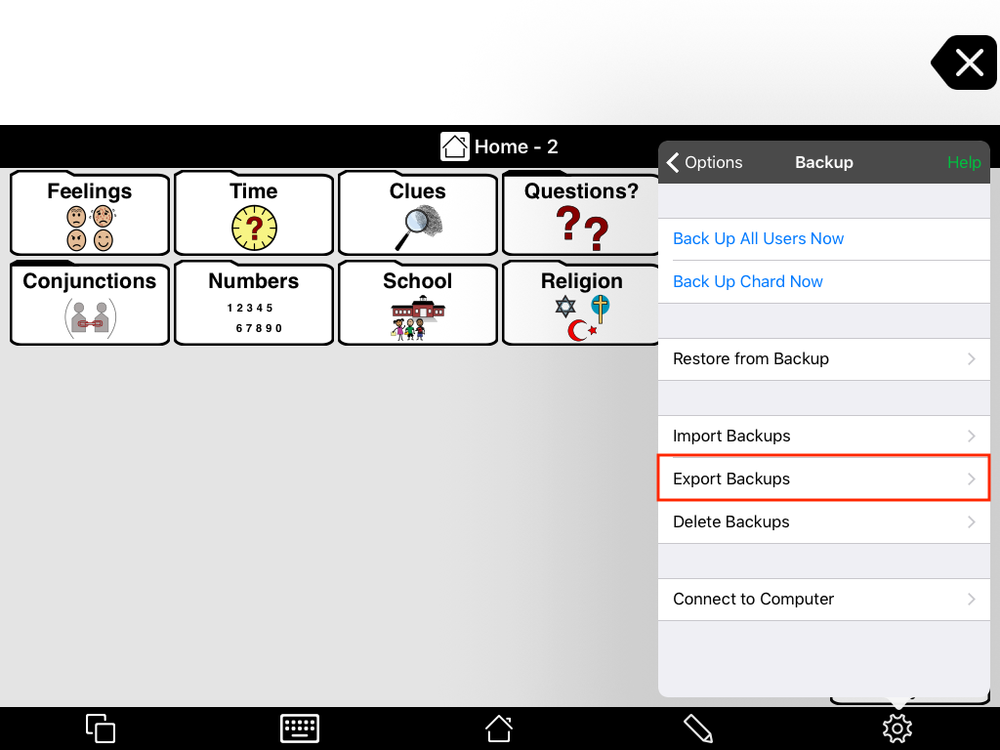
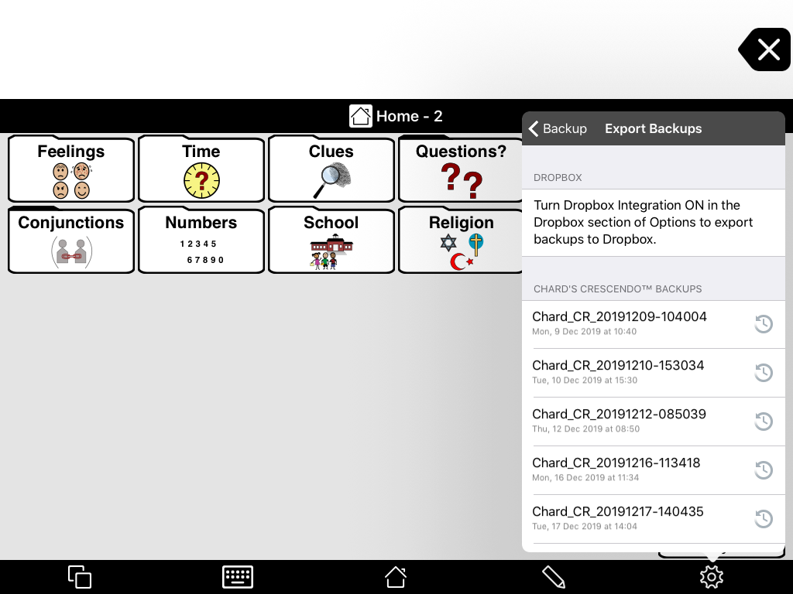
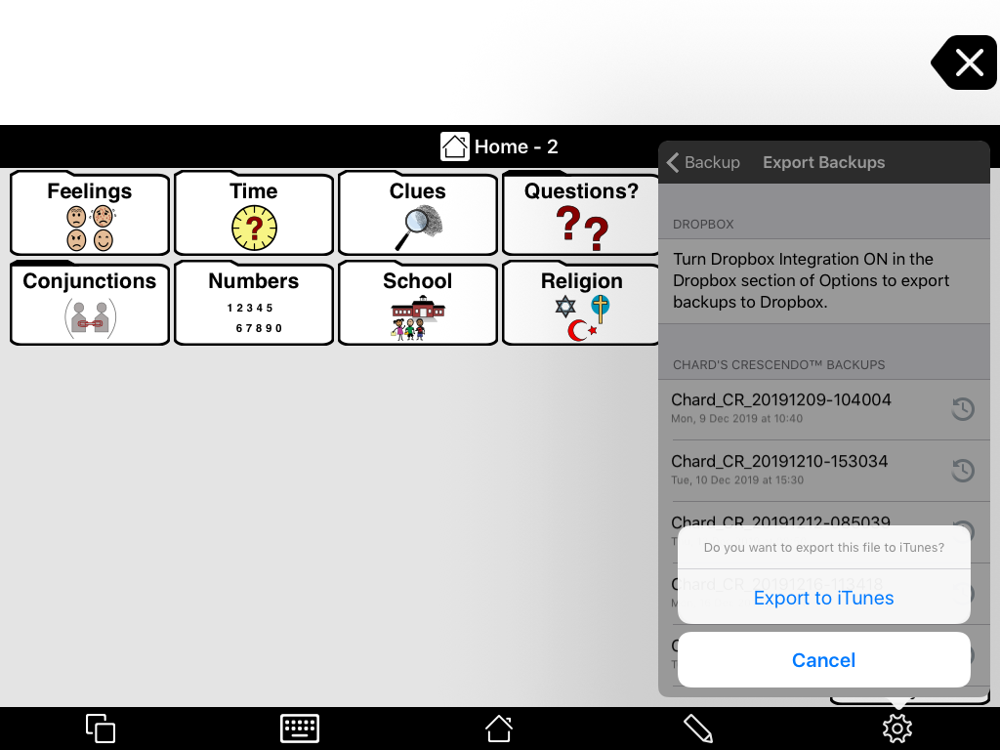
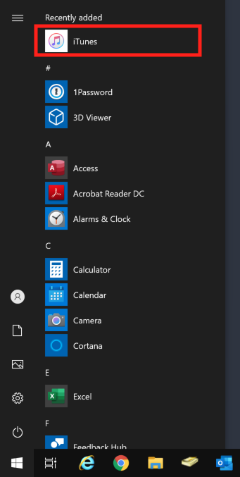
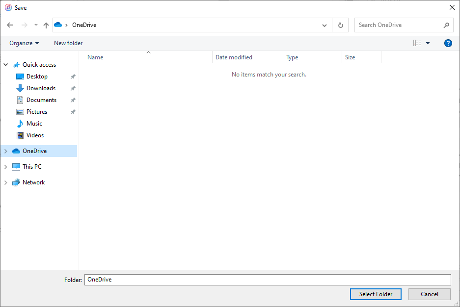
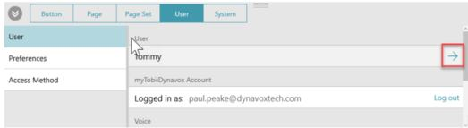
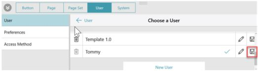

### Setting up OneDrive

When saving iPad backups, you'll need to put them in OneDrive. Most people will already have their OneDrive setup on their PC, but if not, please contact IT and we will help you set it up.

## Proloquo2Go
#### Preparing a Backup:

1. Tap the Options icon in the bottom toolbar.

2. Scroll down and tap Backup.

3. Select Export Backups.

4. Tap the file you want to export in the list. You may need to scroll down to find the file you want.

5. In the menu that appears, tap Export to iTunes.

6. Wait until you see a “Successfully Exported to iTunes” message, then tap OK.

#### Saving a Backup:
1. Connect your iPad to your computer using the iPad’s charging cable.

2. Open iTunes.

3. Click the iPad icon in the upper left corner of the iTunes window.

4. In the menu on the right, click Apps.

5. Find the section called File Sharing and in the Apps column, select the Proloquo2Go app.

6. You will see a list of files. Backup files end in the extension .p2gbk. Select the file you want to save, then click Save to.

7. Select your OneDrive from the window that appears and click Select Folder.

## LAMP Words for Life
#### Preparing a Backup:
1. Select the Vocab button.

2. Touch Choose New Vocab.

3. Touch the Menu button and select Import/Export to iTunes.

4. Choose Export a Vocab and from the menu that pops up, select the vocabulary you want to save.

5. Give the file a name then tap the blue Save button.

#### Saving a Backup:
1. Connect your iPad to your computer using the iPad’s charging cable.

2. Open iTunes.

3. Click the iPad icon in the upper left corner of the iTunes window.

4. In the window that opens on the right, click on the Apps menu at the top.

5. Find the section called File Sharing and in the Apps column, select the LAMP app.

6. From the column under App Documents, choose the vocabulary file you want to save.

7. Click Save to.

8. Select your OneDrive from the window that appears and click Select Folder.

## Snap + Core First
#### Preparing a Backup:
1. In the Editor, select the User editing panel tab.

2. Select the current User to access the management options.

3. Select the save icon for the user you want to save as a backup.

4. Rename your backup if you like, then select Backup.

#### Saving a Backup:
1. Connect your iPad to your computer using the iPad’s charging cable.

2. Open iTunes.

3. Click the iPad’s icon in the upper left corner of the iTunes window.

4. In the menu opens on the right, click Apps.

5. Find the section called File Sharing and in the Apps column, select the Snap + Core First app.

6. Select UserBackups in the Documents browser.

7. Select Save to.

8. Select your OneDrive from the window that appears and click Select Folder.

>If you want to restore a backup you've saved, you'll need to restore it using iTunes. Click [here](restore?id=proloquo2go) to learn how.