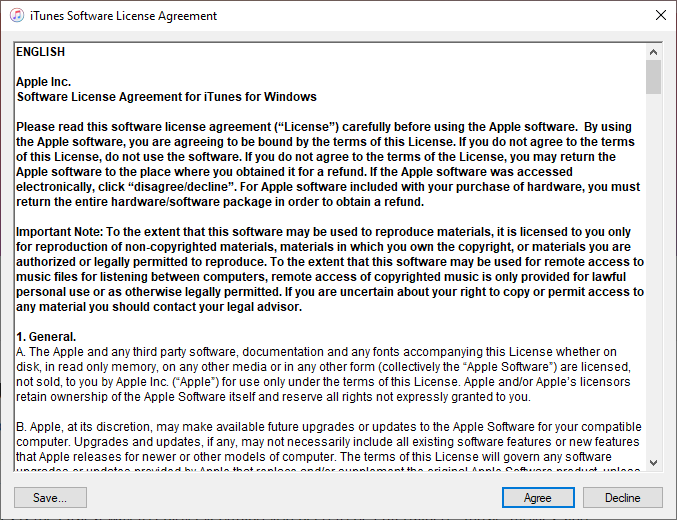
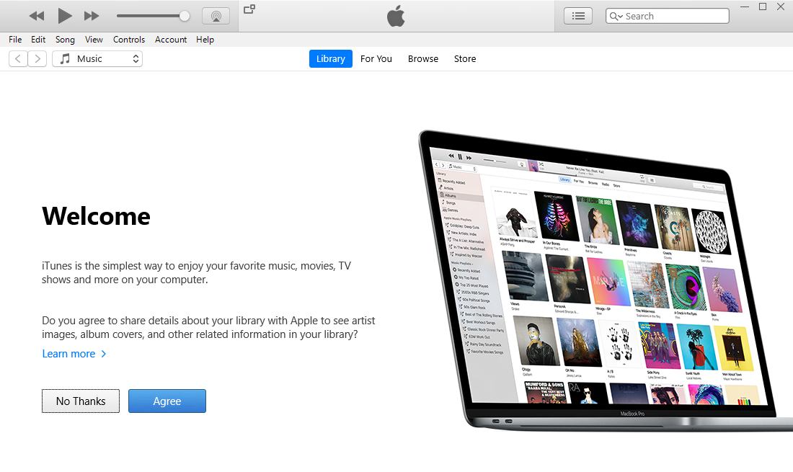
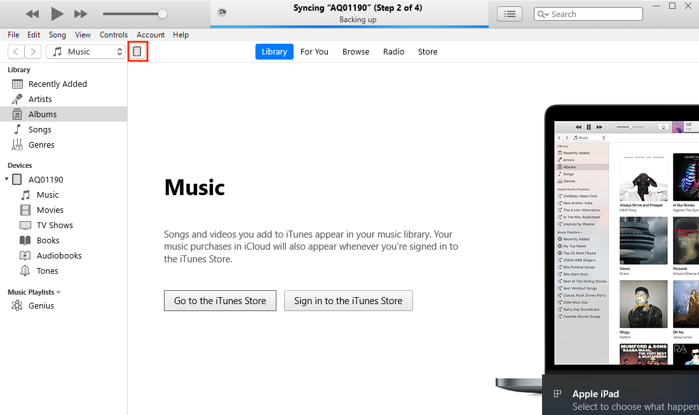
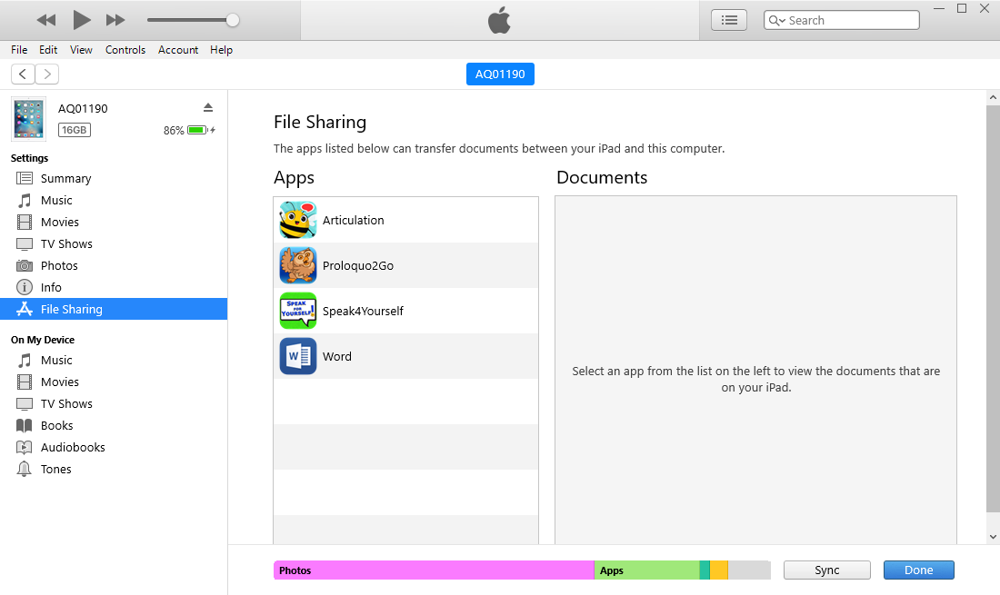

## What is this?

**This documentation will show you how to backup the data from apps you use on your iPad. It will cover most apps used by AQ team members across all departments.**

## Installing iTunes

To backup apps, you'll need to install iTunes on your AQ PC. You can install iTunes yourself through the Microsoft Store. Click the button below to go to the Microsoft Store website.

> 

On the website, click the `Get` button.

A dialogue box will open asking you if you want to open the Microsoft Store app. Click `Open Microsoft Store.`

Click `Install`.

A dialogue box will open asking you to sign in, but you don't need to. Click the close button at the top right of the window.

iTunes will then begin to download.

Click `Launch` to open iTunes

iTunes will then launch with the following window, click Agree.

Once this window appears, click Agree again.

!> If you have any troubles with these steps or iTunes fails to open, please call (07 3273 0040) or [email](mailto:helpdesk@autismqld.com.au) the Helpdesk.

## Connecting your iPad

To backup your app data to your PC, you'll need to connect your iPad to your PC using a Lightning cable (pictured below.

 

First, open iTunes if it is not already open.

 

Connect your iPad to your PC. You'll then see the following messages appear on your iPad:

Tap `Allow`.

Tap `Trust`.

Enter your passcode.

When you see this message appear in iTunes, click `Continue`.

Click the iPad icon once it appears.

From here you can access File Sharing, which is where you save app backups.

>Once you've completed these steps, you're ready to backup the apps on your iPad. Click [here](backup) to get started.