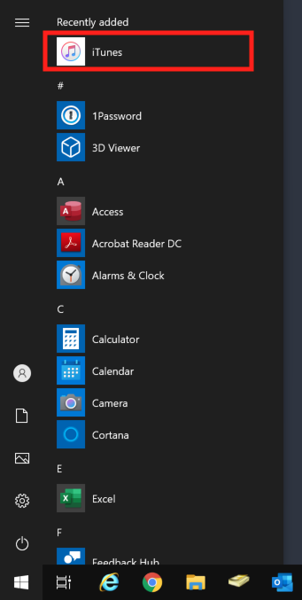
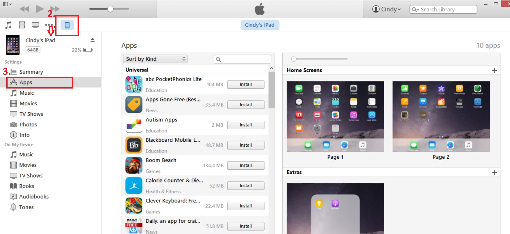

## Proloquo2Go

1. Connect your iPad to your computer using the iPad’s charging cable.

2. Open iTunes.

3. Click the iPad icon in the upper left corner of the iTunes window.

4. In the menu on the right, click Apps.

5. Find the section called File Sharing and in the Apps column, select the Proloquo2Go app.

6. Click Add at the bottom of the Proloquo2Go Documents list.

7. Find and select the backup file (the file will have the extension .p2gbk) that you want to transfer to your device and click Add.

## LAMP Words for Life

1. Connect your iPad to your computer using the iPad’s charging cable.

2. Open iTunes.

3. Click the iPad icon in the upper left corner of the iTunes window.

4. In the menu on the right, click Apps.

5. Find the section called File Sharing and in the Apps column, select the LAMP app.

6. Click Add at the bottom of the LAMP Documents list.

7. Find and select the backup file (the file will have the extension .rtf) that you want to transfer to your device and click Add.

## Snap + Core First

1. Connect your iPad to your computer using the iPad’s charging cable.

2. Open iTunes.

3. Click the iPad icon in the upper left corner of the iTunes window.

4. In the menu on the right, click Apps.

5. Find the section called File Sharing and in the Apps column, select the Snap + Core app.

6. Click Add at the bottom of the Snap + Core Documents list.

7. Find and select the backup file that you want to transfer to your device and click Add.